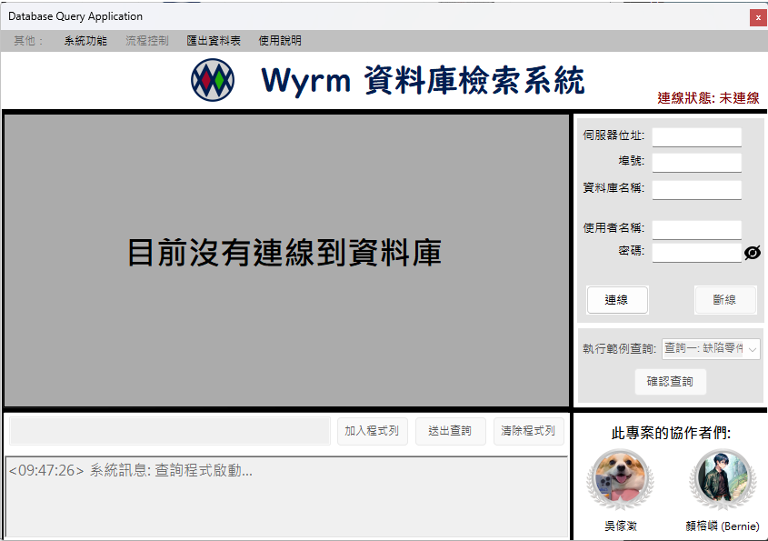
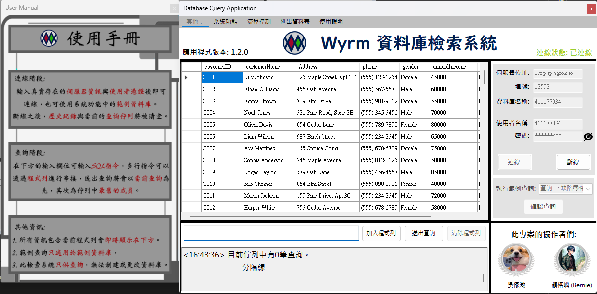

### This project provides multilanguage README.md file
[](https://github.com/Unforgettableeternalproject/Wyrm-DB_GUI-/blob/main/README.md) [](https://github.com/Unforgettableeternalproject/Wyrm-DB_GUI-/blob/main/README.zh-tw.md)

---

# Wyrm GUI

## Overview
Wyrm GUI is a Windows Form application designed for querying MariaDB databases. This application aims to provide users with a simple and intuitive interface to connect to and query databases, visualizing the query results.

## Features
- **Database Connection**: Users can enter the server IP, port, database name, username, and password to connect to the database.
- **Query Functionality**: Supports input of SQL queries and displays the results.
- **Export Results**: Export query results to a CSV file.
- **Error Handling**: Captures and displays common SQL errors.
- **User Manual**: Provides a non-modal (or modal) subform to display application usage information.
- **Interface Enhancements**: Supports animations like fade-in and fade-out on button clicks.

## Screenshots

**Initial Screen**:


**Connected to Database**:


## Installation
1. **Clone the Repository**:
    ```bash
    git clone https://github.com/Unforgettableeternalproject/Wyrm-DB_GUI
    cd Wyrm-DB_GUI
    ```

2. **Open the Project**:
    Open the `Wyrm-DB_GUI.sln` file in Visual Studio.

3. **Build and Run**:
    Build and run the project to use the application.

## Usage
1. **Connect to the Database**:
    - Enter the server IP, port, database name, username, and password in the main interface.
    - Click the "Connect" button to establish a connection.
    - If successful, the database tables will be displayed.

2. **Execute Queries**:
    - Enter SQL queries in the query input box.
    - Press Enter or click the "Execute" button to run the query.
    - Press Shift + Enter to add the current query to the command queue.
    - Press Alt + Enter to clear the command queue and saved queries.
    - The query results will be displayed in the data grid.

3. **Export Results**:
    - Click the "Export" button, choose the save path and file name to export the query results to a CSV file.

4. **Show User Manual**:
    - Click the "User Manual" button in the menu to open a subform containing all usage information.

## Contributors

This project is developed in collaboration with [ßd≥√ÊJ](https://github.com/calculusfkyou).

Others are welcome to submit pull requests or open issues to provide suggestions or report errors!

## Contact
If you have any questions or suggestions, please contact our development team via [](mailto:ptyc4076@gmail.com), [](mailto:charlie930320@gmail.com).

---

You can refer to [here](https://github.com/Unforgettableeternalproject/DB_FinalProject) for our database project, of which Wyrm GUI is the user interface part.