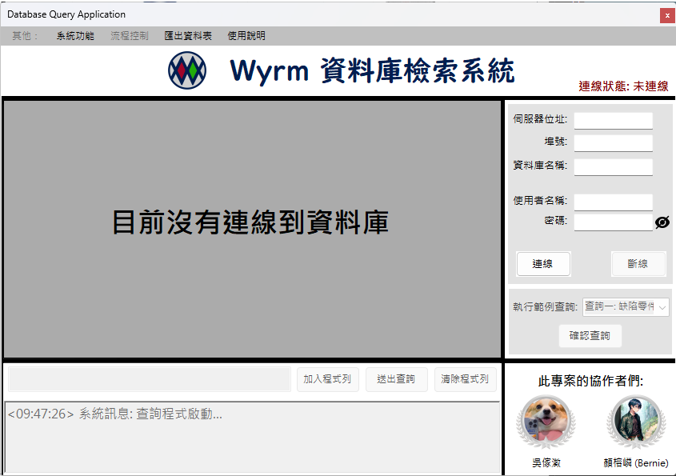
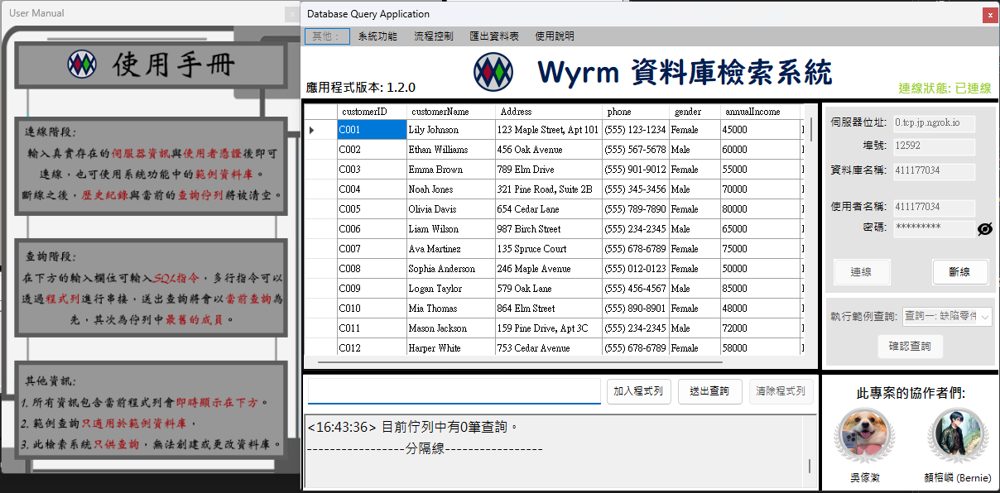

### 此專案提供多種語言之README文件
[](https://github.com/Unforgettableeternalproject/Wyrm-DB_GUI-/blob/master/README.md) [](https://github.com/Unforgettableeternalproject/Wyrm-DB_GUI-/blob/master/README.zh-tw.md)

---

# Wyrm GUI

## 概述
Wyrm GUI 是一個用於查詢 MariaDB 資料庫的 Windows Form 應用程式。本應用程式的設計目的是為了方便使用者連接並查詢資料庫，提供簡單直觀的使用者介面，並可視化查詢結果。

## 功能
- **資料庫連接**：使用者可以輸入伺服器 IP、端口、資料庫名稱、使用者名稱和密碼來連接資料庫。
- **範例資料庫使用**：使用者可以於UserConfig資料夾中輸入對應資料，使系統可以支援範例資料庫的使用以及預設的查詢語句。
- **查詢功能**：支持 SQL 查詢語句的輸入並顯示結果。
- **結果導出**：將查詢結果導出為 CSV 文件。
- **錯誤處理**：捕捉並顯示常見 SQL 錯誤。
- **使用者手冊**：提供一個非模態（或模態）子窗體來顯示應用程式的使用資訊。
- **介面優化**：支持按下按鈕時的動畫效果，如淡入淡出。

## 使用畫面截圖

**原始畫面**：


**已連線到資料庫時**：


## 安裝方式
1. **複製存放庫**：
    ```bash
    git clone https://github.com/Unforgettableeternalproject/Wyrm-DB_GUI
    cd Wyrm-DB_GUI
    ```

2. **開啟專案**：
    在 Visual Studio 中打開 `Wyrm-DB_GUI.sln` 檔案。

3. **編譯與運行**：
    編譯並運行專案即可使用應用程式。

## 使用方式
1. **連接資料庫**：
    - 在應用程式主介面中輸入伺服器 IP、端口、資料庫名稱、使用者名稱和密碼。
    - 點擊 "連接" 按鈕進行連接。
    - 如果連接成功，會顯示資料庫中的表格。

2. **執行查詢**：
    - 在查詢框中輸入 SQL 查詢語句。
    - 按下 Enter 鍵或點擊 "送出查詢" 按鈕執行查詢。
    - 按下 Shift + Enter 或點擊 "加入程式列" 能夠將當前語句加入程式列
    - 按下 Alt + Enter 或點擊 "清空程式列"以清空當前程式列與已儲存的查詢
    - 查詢結果將顯示在資料表格中。

3. **導出結果**：
    - 點擊 "導出" 按鈕，選擇保存路徑和文件名，即可將查詢結果導出為 CSV 文件。

4. **顯示使用者手冊**：
    - 在選單中點擊 "使用者手冊" 按鈕，將打開一個包含所有使用資訊的子窗體。
    
## 範例資料庫的更新

- 我們已更新範例資料庫的運作方式。現在，用戶需要提供自己的資料庫憑證和示例查詢，以便更好地定制和測試應用程序。請參閱[範例數據庫使用說明](Example%20Database%20Usage.txt)以獲取更多詳細訊息。

## 已知問題

- 該應用程式設計用於使用特定的資料庫模式。如果資料庫架構不同，應用程式可能無法如預期運作。

## 代辦事項

- 增加對多種語言的支援。
- 新增對不同資料庫模式的支援。
- 新增對更複雜 SQL 查詢的支援。
- 新增對更多資料庫操作的支援。

## 貢獻者

此為與[吳傢澂](https://github.com/calculusfkyou)共同開發之資料庫專案

也歡迎其他人加以提交 pull requests 或開啟 issues 提出建議或回報錯誤!

## 聯絡方式
如有任何問題或建議，請聯絡我們的開發團隊 [
](mailto:ptyc4076@gmail.com), [](mailto:charlie930320@gmail.com)。

---

您可以參考[這裡](https://github.com/Unforgettableeternalproject/DB_FinalProject)查看我們的資料庫專案，Wyrm GUI 是其使用者介面部分。